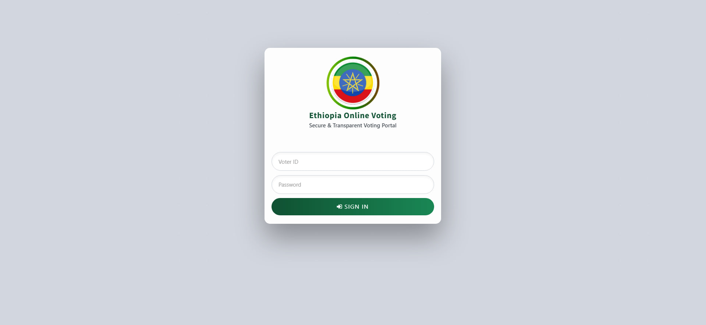
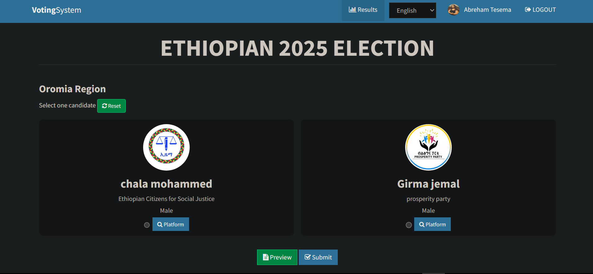
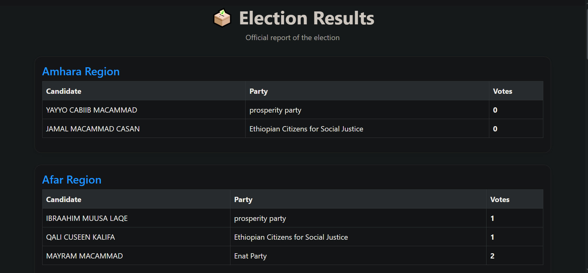
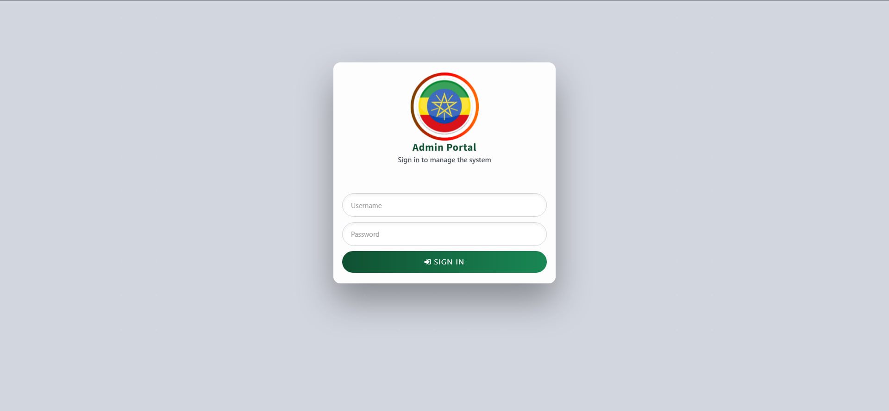
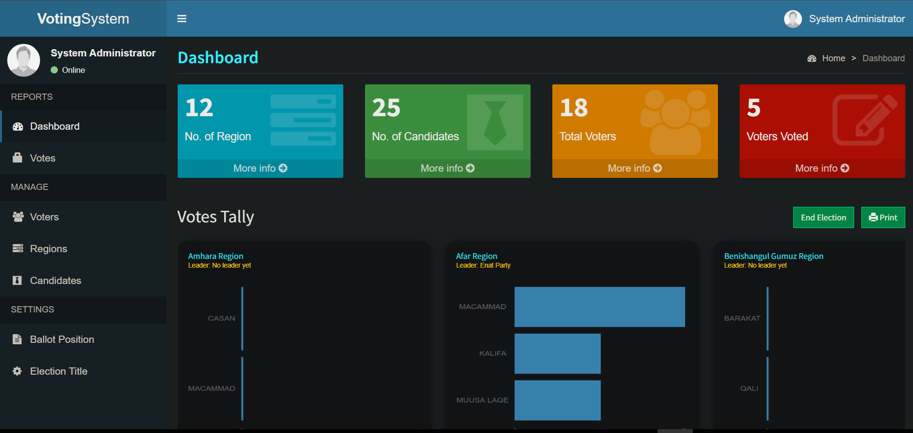
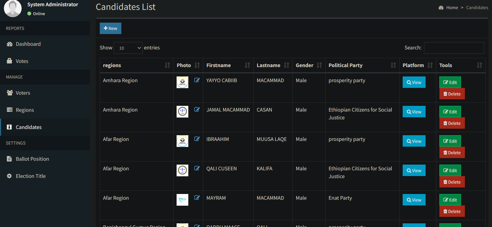

# 🗳️ Online Voting System (OEMS) - Final Graduation Project

A secure and efficient web-based voting platform built with **HTML**, **CSS** , **JAVASCRIPT**, **PHP** and **MySQL**, designed to support government and public elections. It features a dual-panel architecture — a voter-facing interface for casting ballots and a secure admin panel for managing the entire election lifecycle.

---

##  Preview


## 📸 Screenshots


### Voter Login


### Voter Ballot


### Election Results


### Admin Login


### Admin Dashboard


### Candidates Management


---

## ✨ Features

### Voter Side
- Voter login with ID and hashed password authentication
- Region-based ballot display
- One-time vote submission with validation
- View election results after voting (when enabled by admin)

### Admin Panel
- Secure admin login and session management
- Dashboard with live statistics (regions, candidates, total voters, votes cast)
- Full CRUD management for:
  * **Positions / Regions** — with ordering (up/down)
  * **Candidates** — with photo upload and position assignment
  * **Voters** — with photo upload and credential management
- Election control — start election with configurable end time
- Toggle homepage visibility and results visibility
- Votes tally with printable report
- Vote reset functionality
- Admin profile update

---

## 🛠️ Tech Stack

| Layer        | Technology                                |
| ------------ | ----------------------------------------- |
| Backend      | PHP (procedural)                          |
| Database     | MySQL (via MySQLi)                        |
| Frontend     | Bootstrap 3, AdminLTE                     |
| Charts       | Chart.js, Flot                            |
| Rich Text    | CKEditor                                  |
| Icons        | Ionicons, Font Awesome                    |
| PDF Export   | TCPDF                                     |

---

## 📁 Project Structure

```
online-voting-system/
├── admin/                  # Admin panel
│   ├── includes/           # Shared components (conn, session, header, nav, modals)
│   ├── index.php           # Admin login
│   ├── home.php            # Dashboard
│   ├── candidates.php      # Candidate management
│   ├── voters.php          # Voter management
│   ├── positions.php       # Position/region management
│   ├── votes.php           # Votes log
│   ├── votes_reset.php     # Reset all votes
│   ├── election_control.php# Start/stop election
│   ├── report.php          # Printable results report
│   └── config.ini          # Election title config
├── includes/               # Voter-side shared components
├── db/
│   └── votesystem.sql      # Database dump
├── languages_*.php         # Language files (10 languages)
├── screenshots/            # App screenshots
├── index.php               # Voter login page
├── home.php                # Voter ballot page
├── submit_ballot.php       # Ballot submission handler
├── voter_results.php       # Results page for voters
├── login.php               # Voter authentication handler
├── logout.php              # Session termination
└── signup.php              # Voter self-registration (if enabled)
```

---

## ⚙️ Requirements

- **XAMPP** (or any LAMP/WAMP stack)
  * Apache
  * PHP 7.4+
  * MySQL 5.7+
- A web browser (Chrome, Firefox, Edge)
- A text editor (VS Code, Sublime Text, etc.)

---

## 🚀 Installation & Setup

**1. Clone the repository**
```bash
git clone https://github.com/DuDu21cs/Online_Voting_System.git
```

**2. Move the project to your web server root**
- For XAMPP on Windows: `C:/xampp/htdocs/`
```
htdocs/
└── online-voting-system-using-PHP-main/
```

**3. Create the database**
- Start Apache and MySQL in XAMPP Control Panel
- Open `http://localhost/phpmyadmin`
- Create a new database named `votesystem`
- Click **Import**, select `db/votesystem.sql`, and click **Go**

**4. Configure the database connection**

Open `admin/includes/conn.php` and update if needed:
```php
$conn = new mysqli('localhost', 'root', '', 'votesystem');
```

**5. Run the application**
```
Voter panel: http://localhost/online-voting-system-using-PHP-main/
Admin panel: http://localhost/online-voting-system-using-PHP-main/admin/
```

---

## 🖥️ Usage

### Admin Workflow
1. Log in to the admin panel at `/admin/`
2. Add **Regions** (election positions/constituencies)
3. Add **Candidates** and assign each to a region
4. Register **Voters** with their credentials
5. Go to **Election Control** to start the election
6. Monitor live vote tallies from the **Dashboard**
7. Enable results visibility so voters can view outcomes
8. Generate and print the results report from **Report**

### Voter Workflow
1. Visit the homepage and log in with your Voter ID and password
2. The ballot is displayed based on your assigned region
3. Select your candidate and submit your ballot
4. Once the admin enables results, view the outcome from your dashboard

---

## 🗄️ Database Schema

| Table               | Description                                                                |
| ------------------- | -------------------------------------------------------------------------- |
| `admin`             | Admin user credentials                                                     |
| `voters`            | Registered voter accounts                                                  |
| `positions`         | Election positions / regions                                               |
| `candidates`        | Candidates linked to positions                                             |
| `votes`             | Individual vote records                                                    |
| `election_settings` | Key-value store for election state                                         |

---

## 🌐 Multi-Language Support

The system supports **10 languages**, selectable from the voter interface:

| Code  | Language              |
| ----- | --------------------- |
| `en`  | English               |
| `am`  | Amharic               |
| `om`  | Afaan Oromoo          |
| `ti`  | Tigrinya              |
| `so`  | Somali                |
| `sg`  | Sidaama               |
| `wal` | Wolaita               |
| `hd`  | Hadiyya               |
| `aa`  | Afar                  |

---

## 🔒 Security Notes

- Voter passwords are stored using PHP's `password_hash()` and verified with `password_verify()`
- Admin and voter sessions are managed separately
- Change default database credentials before deploying
- For production, consider adding CSRF protection and HTTPS enforcement

---

## 📄 License

This project is open source and available under the [MIT License](LICENSE).

---

## 📫 Contact

**Duresa Chemeda**
- GitHub: [@DuDu21cs](https://github.com/DuDu21cs)
- Email: [duresachemedadudu@gmail.com](mailto:duresachemedadudu@gmail.com)
- LinkedIn: [Duresa Chemeda](https://www.linkedin.com/in/duresa-chemeda-66a28a411/)
